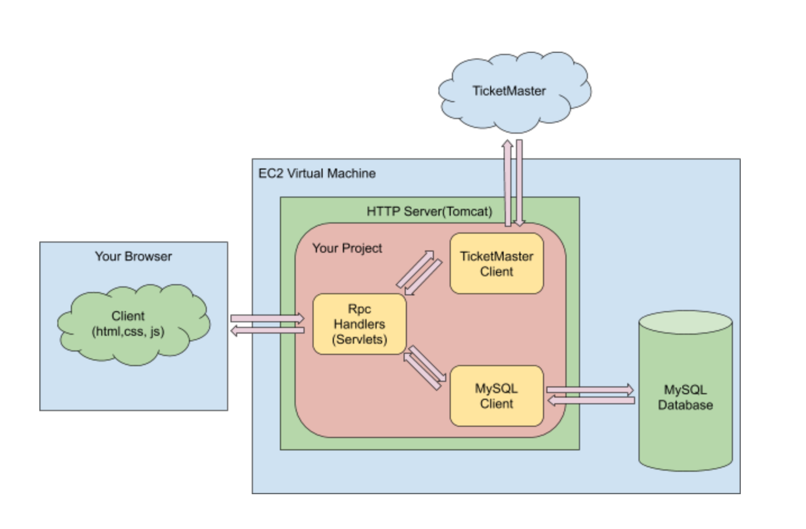

### Ticketing 
The project aims to use personalization to improve ticket search and recommendation

The main language for this project is Java, JS, HTML, CSS 

Some of the key functions: 
1. Created Java servlets with RESTful APIs to handle HTTP requests and responses
2. Built relational and NoSQL databases (MySQL, MongoDB) to capture event data (name, description, location, parking info) from TicketMaster API
3. Designed algorithms (e.g., content-based recommendation) to improve event recommendation based on search history and favorite records)
4. Deployed server to Amazon EC2.

Sturcture of this project: 

